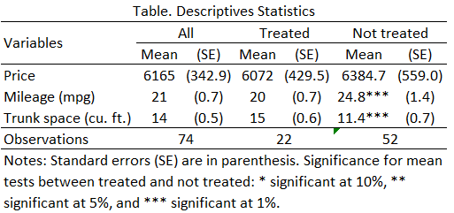

# Descriptive statistics and statistical elements

This repository contains Stata scripts for conducting various statistical analyses, including descriptive statistics, mean and median tests, and t-statistic/z-statistic computations.

## Files Overview

### 1. **descriptive-statistics.do**
This script generates descriptive statistics for a dataset, including summary measures for different groups, and exports formatted results into CSV and Excel files.

#### Key Features:
- Calculates summary statistics (mean, standard deviation) for specified variables.
- Performs group-wise descriptive analysis based on a treatment variable.
- Outputs formatted tables to CSV (`table.csv`) and Excel (`table.xlsx`).
- Supports LaTeX export (`table.tex`) for integration with reports.

#### How to Use:
- Ensure your dataset contains variables similar to the example variables (`price`, `mpg`, etc.).
- Modify the `global vars` line to specify variables of interest.
- Run the script in Stata to produce summary tables.

---

### 2. **mean-median-test.do**
This script performs hypothesis testing for means and medians, including paired and unpaired tests, and automates the extraction of p-values for comparisons.

#### Key Features:
- Conducts paired and unpaired t-tests.
- Performs sign and signed-rank tests for medians.
- Computes p-values for mean comparisons across multiple subgroups.

#### How to Use:
- Load your dataset and ensure variables (`bp`, `when`, `patient`) match the example structure.
- Adjust categorical and grouping variables as needed.
- Run the script for detailed output on mean and median comparisons.

---

### 3. **pvalue-z-t.do**
This script calculates t-statistics and z-statistics, extracts key results, and stores them in matrices for easy reporting.

#### Key Features:
- Computes linear combinations of coefficients.
- Extracts t-statistic and z-statistic results, including p-values.
- Demonstrates differences between t-distribution and normal distribution tests.

#### How to Use:
- Load your dataset and ensure variables (`mpg`, `fore`, `rep`) align with the example.

---

# Example of descriptive statistics using matrices in Stata

